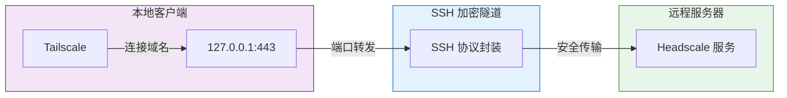
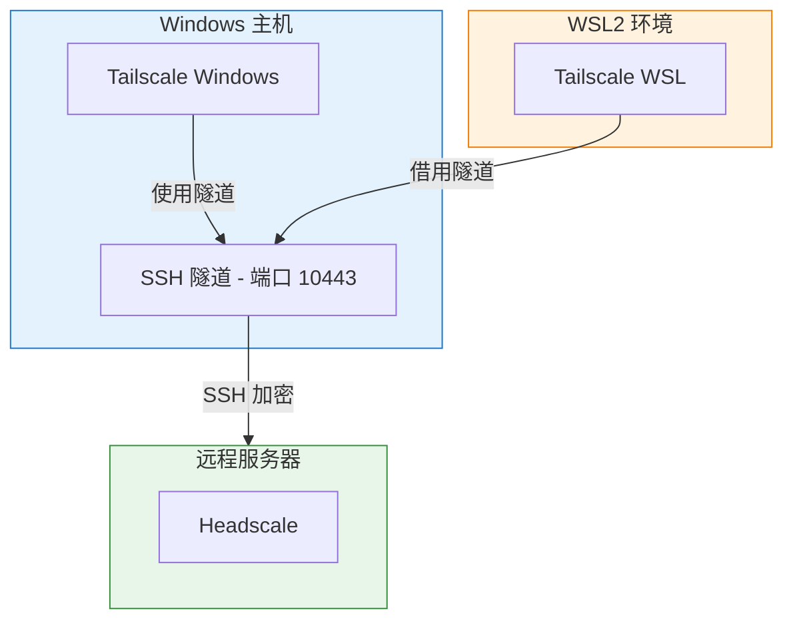

# msh (Matryoshka-SHell)

通过 SSH 隧道安全连接 Headscale，绕过网络中的 TLS 深度包检测 (DPI)。

**[Linux/macOS](#快速开始) | [Windows PowerShell](win-powershell/)**

## 何时需要 msh？

- 网络环境对 TLS 连接进行 DPI 审查，导致 Headscale 连接失败或被重置
- 需要通过 SSH 隧道安全访问自建 Headscale 服务

## 工作原理



**核心思路**：通过 `/etc/hosts` 将 Headscale 域名指向本地 `127.0.0.1`，Tailscale 客户端连接本地端口，SSH 隧道将流量转发到远程服务器。TLS 握手封装在 SSH 协议内，无法被 DPI 审查。

## 快速开始

### 前提条件

1. 已配置到 Headscale 服务器的 **SSH 免密登录**
2. 已安装 `tailscale` 客户端
3. 已在 `/etc/hosts` 添加：`127.0.0.1 your.headscale.domain`

### 安装

```bash
git clone https://github.com/w31r4/msh.git
cd msh && sudo ./install.sh
```

### 基本用法

```bash
msh start     # 首次运行会引导配置，之后一键启动隧道并激活节点
msh status    # 检查隧道和节点状态
msh stop      # 关闭隧道
```

## 命令参考

| 命令 | 说明 | 示例 |
|-----|------|-----|
| `start` | 启动隧道并激活节点 | `msh start --port 10443 --expiration 30d` |
| `stop` | 关闭隧道 | `msh stop` |
| `status` | 检查状态 | `msh status` |
| `activate` | 仅激活节点，复用已有隧道 | `msh activate --port 10443` |
| `link <key>` | 使用已有密钥激活，自动启动隧道 | `msh link hskey-xxx` |
| `config get` | 查看配置 | `msh config get SSH_USER` |
| `config set` | 修改配置 | `msh config set TUNNEL_PORT 10443` |
| `config edit` | 编辑配置文件 | `msh config edit` |
| `help` | 显示帮助 | `msh help` |

### 常用选项

| 选项 | 说明 | 默认值 |
|-----|------|-------|
| `--port <端口>` | 指定隧道本地端口 | 443 |
| `--expiration <时长>` | 预授权密钥有效期 | 8h |

## WSL + Windows 协作

在 Windows 11 WSL2 `mirrored` 网络模式下，Windows 和 WSL 共享网络接口。推荐在 Windows 建立隧道，WSL 借用：



```powershell
# Windows 端启动隧道
.\win-powershell\msh.ps1 start
```

```bash
# WSL 端借用隧道激活
msh activate
```

详见 [Windows PowerShell 版本文档](win-powershell/)。

## 配置文件

首次运行会自动引导配置，配置保存在 `~/.config/msh/config.sh`：

| 配置项 | 说明 |
|-------|------|
| `SERVER_IP` | Headscale 服务器 IP |
| `HEADSCALE_DOMAIN` | Headscale 域名 |
| `SSH_USER` | SSH 登录用户名 |
| `SSH_KEY_PATH` | SSH 私钥路径 |
| `USER` | Headscale 用户名 |
| `TUNNEL_PORT` | 隧道本地端口 |

## 故障排查

| 问题 | 解决方案 |
|-----|---------|
| `/etc/hosts` 缺少条目 | 添加 `127.0.0.1 your.headscale.domain` |
| SSH 密钥认证失败 | 运行 `ssh-add ~/.ssh/id_rsa` 加载密钥 |
| 端口 443 被占用 | 使用 `msh start --port 10443` |
| 未检测到 SSH 隧道 (WSL) | Windows 端先运行 `.\msh.ps1 start` |
| 预授权密钥获取失败 | 检查服务器 Headscale 服务状态和 SSH 配置 |

## 卸载

```bash
sudo ./uninstall.sh
```

## License

MIT
