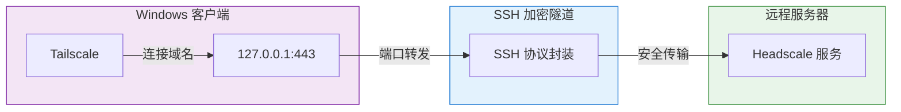
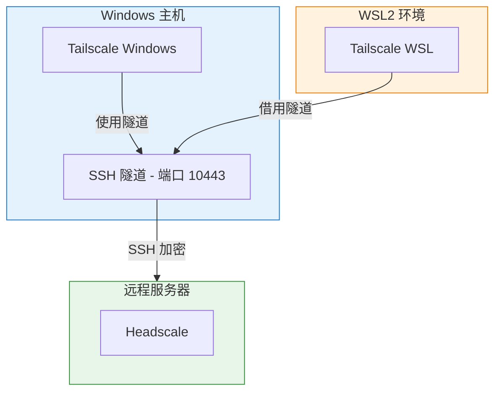

# msh (Matryoshka-SHell) - Windows PowerShell 版

通过 SSH 隧道安全连接 Headscale，绕过网络中的 TLS 深度包检测 (DPI)。

这是 [msh](../) 的 Windows PowerShell 实现。

## 何时需要 msh？

- 网络环境对 TLS 连接进行 DPI 审查，导致 Headscale 连接失败
- 需要通过 SSH 隧道安全访问自建 Headscale 服务

## 工作原理



## 快速开始

### 前提条件

1. 已安装 [Tailscale for Windows](https://tailscale.com/download/windows)
2. 已配置到 Headscale 服务器的 **SSH 免密登录**
3. 已在 `C:\Windows\System32\drivers\etc\hosts` 添加：`127.0.0.1 your.headscale.domain`
4. SSH Agent 已启动并加载密钥：
   ```powershell
   Start-Service ssh-agent
   ssh-add ~\.ssh\id_rsa
   ```

### 基本用法

```powershell
.\msh.ps1 start     # 首次运行会引导配置，之后一键启动
.\msh.ps1 status    # 检查状态
.\msh.ps1 stop      # 关闭隧道
```

## 命令参考

| 命令 | 说明 | 示例 |
|-----|------|-----|
| `start` | 启动隧道并激活节点 | `.\msh.ps1 start -Port 10443 -Expiration 30d` |
| `stop` | 关闭隧道 | `.\msh.ps1 stop` |
| `status` | 检查状态 | `.\msh.ps1 status` |
| `activate` | 仅激活节点 | `.\msh.ps1 activate` |
| `link` | 使用已有密钥激活 | `.\msh.ps1 link -Key hskey-xxx` |
| `config get` | 查看配置 | `.\msh.ps1 config get SSH_USER` |
| `config set` | 修改配置 | `.\msh.ps1 config set TUNNEL_PORT 10443` |
| `config edit` | 编辑配置文件 | `.\msh.ps1 config edit` |
| `help` | 显示帮助 | `.\msh.ps1 help` |

### 常用参数

| 参数 | 说明 | 默认值 |
|-----|------|-------|
| `-Port <端口>` | 指定隧道本地端口 | 443 |
| `-Expiration <时长>` | 预授权密钥有效期 | 8h |

## WSL + Windows 协作

在 Windows 11 WSL2 `mirrored` 网络模式下，推荐 Windows 建立隧道，WSL 借用：



```powershell
# 1. Windows 端启动隧道
.\msh.ps1 start
```

```bash
# 2. WSL 端借用隧道激活
msh activate
```

完成后，Windows 和 WSL 作为两个独立设备加入 Headscale 网络。

## 配置文件

首次运行自动引导配置，保存在 `%LOCALAPPDATA%\msh\config.json`：

```json
{
  "SERVER_IP": "1.2.3.4",
  "HEADSCALE_DOMAIN": "your.headscale.domain",
  "SSH_USER": "root",
  "SSH_KEY_PATH": "C:\\Users\\YourUser\\.ssh\\id_rsa",
  "USER": "your-headscale-user",
  "TUNNEL_PORT": 443
}
```

## 故障排查

| 问题 | 解决方案 |
|-----|---------|
| hosts 文件缺少条目 | 以管理员权限编辑 `C:\Windows\System32\drivers\etc\hosts` |
| SSH 密钥认证失败 | 运行 `ssh-add ~\.ssh\id_rsa` |
| 缺少依赖 | 确保 `tailscale`、`ssh` 在 PATH 中 |
| 脚本无响应 | SSH 可能在等待密码，检查免密登录配置 |
| 预授权密钥获取失败 | 检查服务器 Headscale 服务状态 |

## License

MIT
